# Loudspeaker Layouts
The following loudspeaker layouts can be rendered binaurally using obr.

### Mono
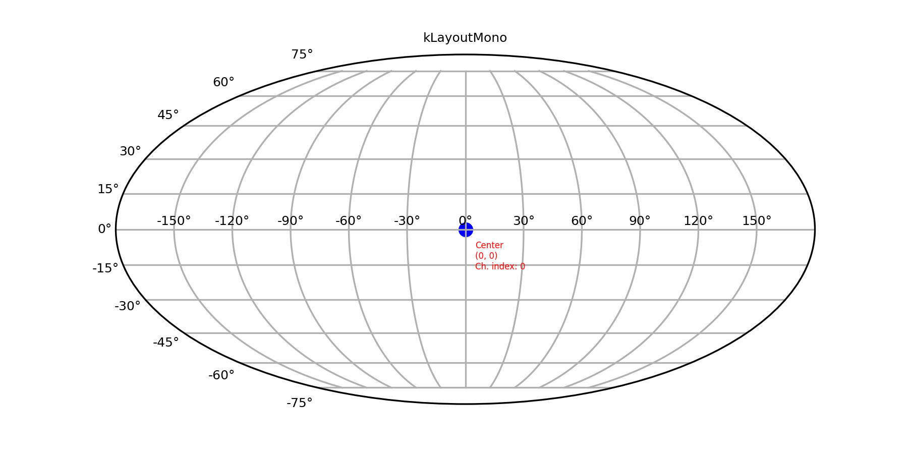

### Stereo
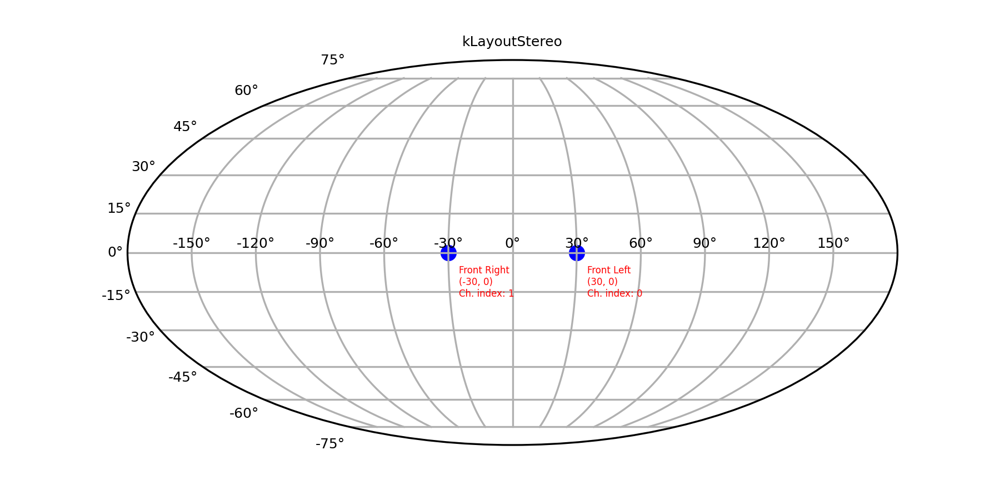

### 3.1.2
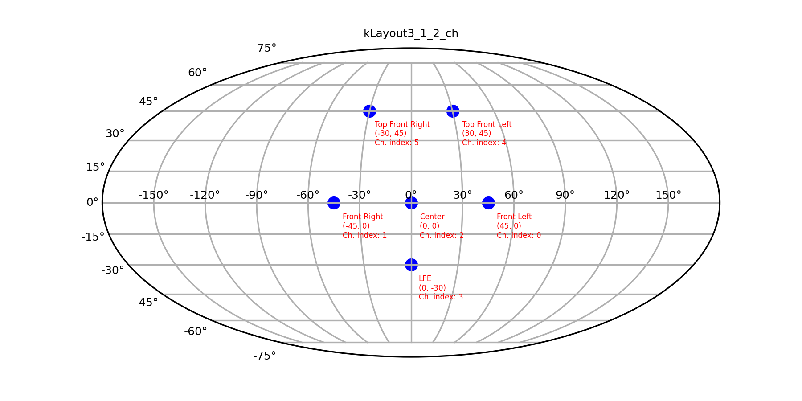

### 5.1
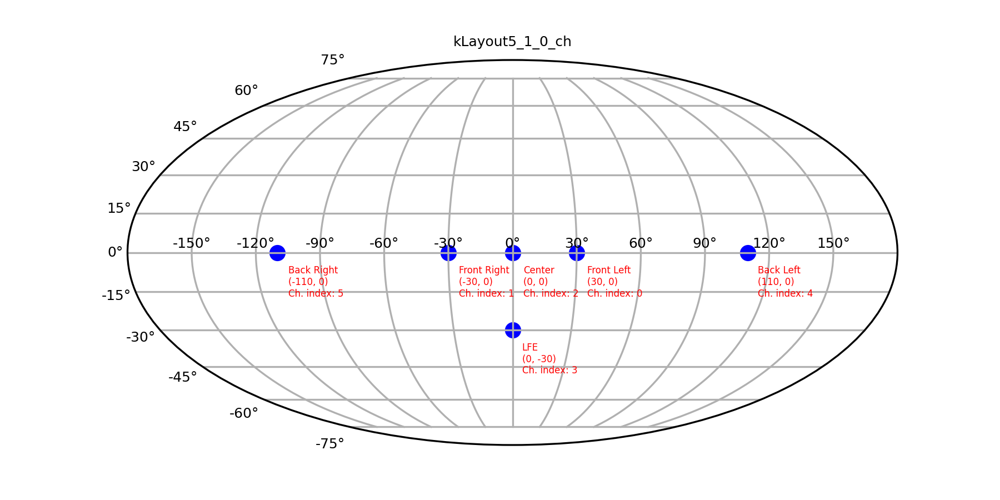

### 5.1.2
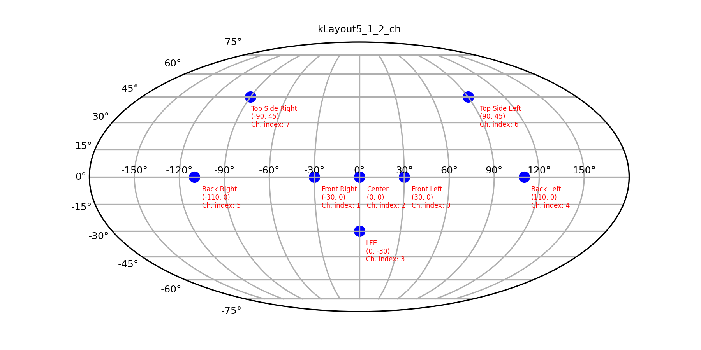

### 5.1.4
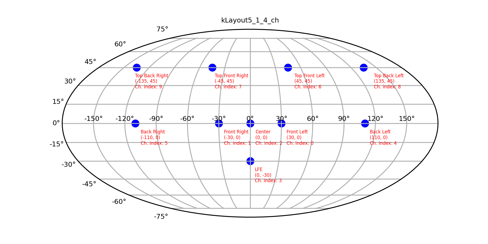

### 7.1
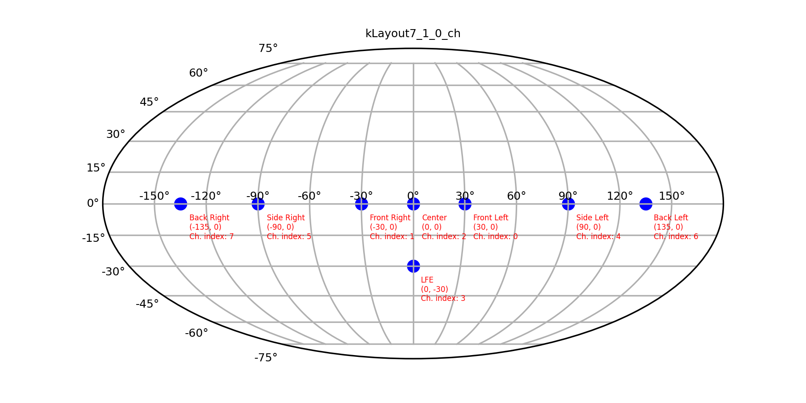

### 7.1.2
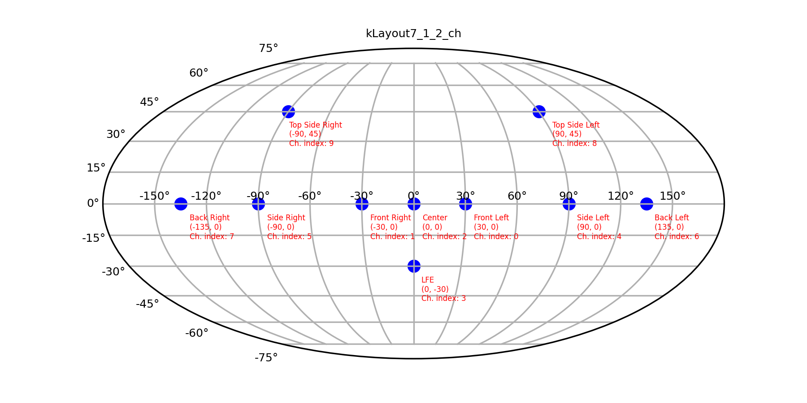

### 7.1.4
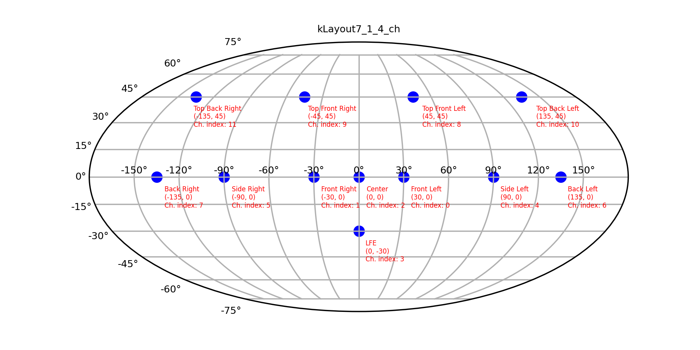

### 9.1
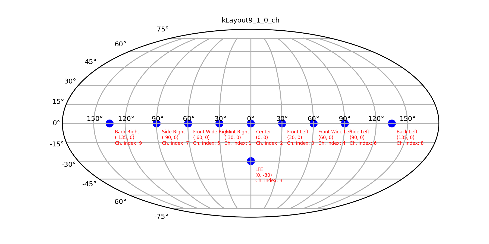

### 9.1.2
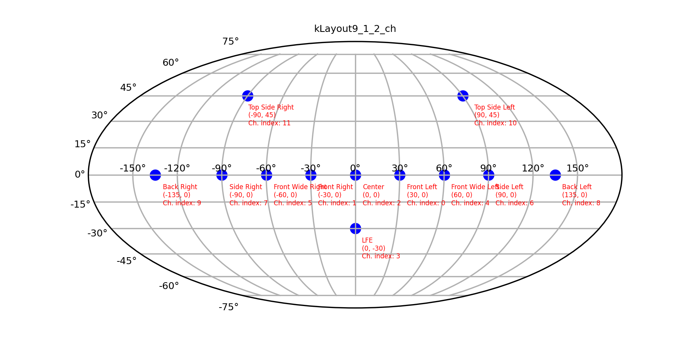

### 9.1.4
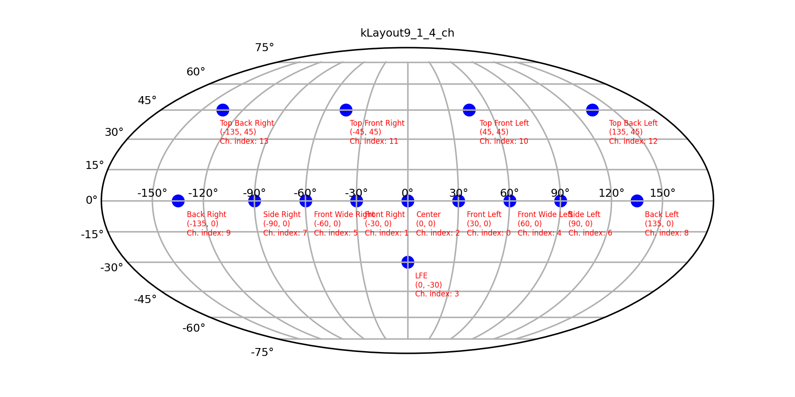

### 9.1.6
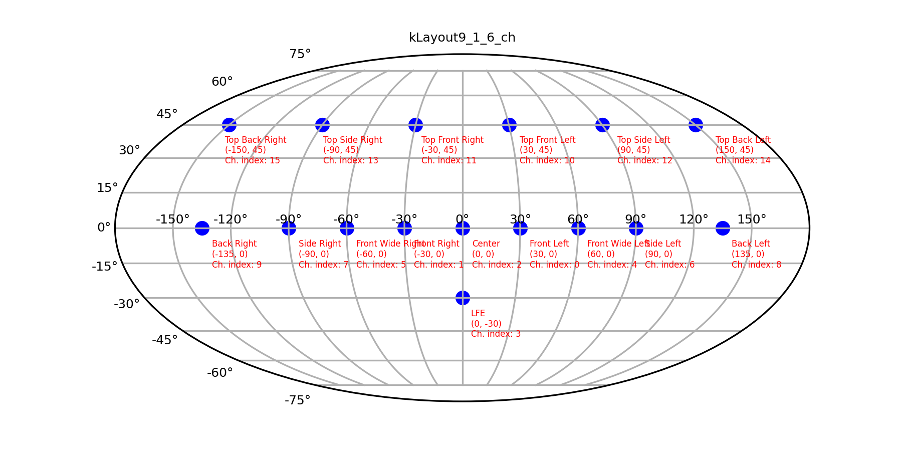
